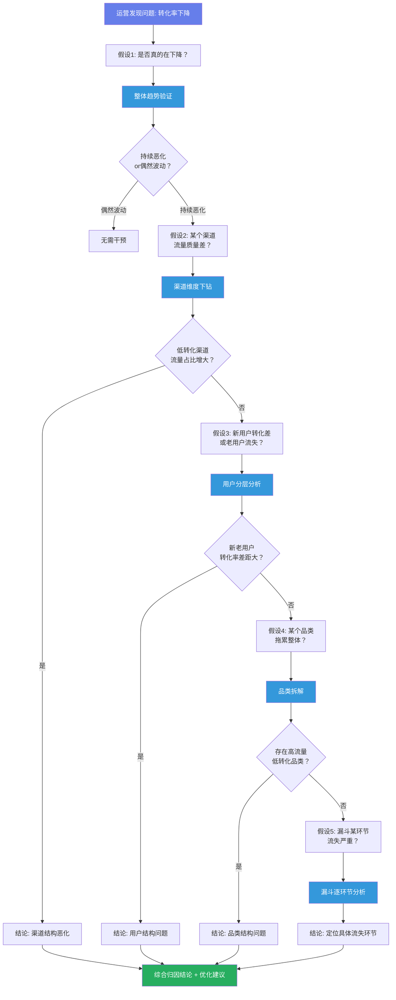
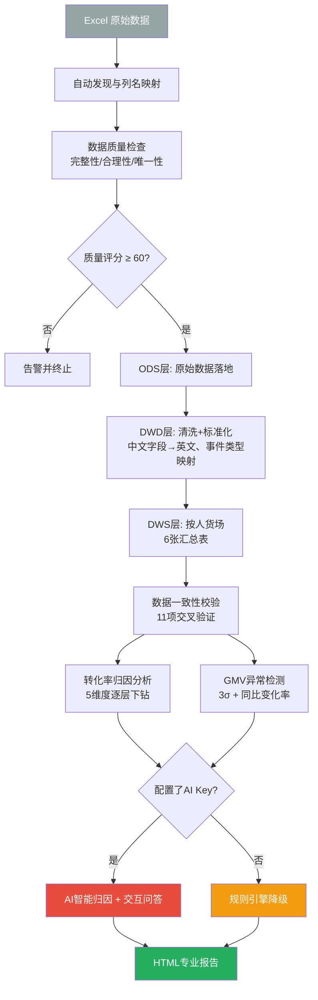

# 数据+AI驱动电商运营分析系统 — 作品集

> **一句话总结**：从0到1搭建了一套完整的电商运营分析系统，核心能力是**当GMV或转化率出现异常时，系统自动从整体→渠道→用户→品类→漏斗逐层下钻定位根因**，并将AI深度整合到代码开发、智能归因、自然语言交互三个层次。

---

## 一、项目背景与我的思考起点

### 1.1 电商运营的真问题

电商运营面临一个核心矛盾：**流量越来越贵，但转化率却持续走低**。运营团队每次遇到数据异常时的标准流程是：

```
手动导出Excel → 在Excel里画折线图 → 凭经验猜测原因 → 拉会讨论 → 做决策
```

这个流程的问题很明显：**每次都要重来一遍，且归因严重依赖个人经验，容易遗漏结构性因素。**

### 1.2 我的核心假设

在动手写代码之前，我先明确了分析假设：

> **转化率下降一定有结构性原因，不是"整体恶化"。它必然可以被拆解为某个渠道流量质量变差、某个品类转化拖后腿、某个用户群表现异常、或漏斗某个环节出了问题。**

基于这个假设，我需要一套**能自动逐层下钻、在每一层验证或排除假设、最终定位根因**的系统。

### 1.3 我的分析思路

我用下面的流程图来组织整个分析逻辑——每一层都在验证一个具体假设：



> **为什么是这个顺序？** 从宏观到微观逐层收敛：先确认「是不是真的有问题」→ 再查「哪个入口（渠道）有问题」→ 再看「谁（用户）有问题」→ 然后查「什么东西（品类）有问题」→ 最后定位「哪个环节（漏斗）有问题」。这个顺序保证每一层排除一种可能性后再进入下一层，避免遗漏。

---

## 二、系统架构与数据设计

### 2.1 整体架构



### 2.2 三层数仓设计

| 分层 | 名称 | 解决的问题 | 本项目的实现 |
|------|------|-----------|-------------|
| **ODS** | 操作数据层 | 原始数据如何无损入库 | `ods_user_behavior`：Excel数据原样入SQLite |
| **DWD** | 明细数据层 | 脏数据如何清洗标准化 | `dwd_user_behavior_detail`：中文字段→英文、事件类型映射、时间标准化 |
| **DWS** | 汇总数据层 | 分析需要什么粒度 | 6张汇总表按"人-货-场"框架组织，分别是日粒度 |

### 2.3 "人-货-场"指标体系

我按电商经典的"人-货-场"框架设计了指标体系，每个维度都有一级指标和二级下钻指标：

| 维度 | 核心指标 | 下钻维度 | 汇总表 |
|------|---------|---------|--------|
| 场（流量与转化） | PV/UV、转化率 | 渠道、设备 | `dws_traffic_daily` `dws_conversion_daily` |
| 人（用户价值） | 新增/活跃、复购率、留存率 | 新老用户 | `dws_user_daily` |
| 货（商品效率） | GMV、动销率、转化率 | 品类 | `dws_product_daily` `dws_category_daily` |
| 综合（收入健康度） | GMV、客单价、订单数 | 时间趋势 | `dws_gmv_daily` |

> **指标之间不是孤立的。** 我的分析框架的核心逻辑是：GMV = 流量 × 转化率 × 客单价。任何一个指标变化，都能顺着这个公式拆解到具体原因。

### 2.4 数据质量保障

分析结果可不可信，取决于输入数据的质量。我设计了三道防线：

1. **源头检查**：缺失值、异常值、重复值 → 质量评分（本例数据得分 **72.9/100**，扣分项主要是87%的重复率——这在用户行为日志中常见，因为同一用户同一天访问同一商品会产生多条记录）
2. **数仓校验**：11项交叉验证（ODS→DWD行数、DWD→DWS汇总、GMV交叉验证等）→ 本次校验通过率 **100%**
3. **AI降级**：API不可用时自动切换到规则引擎，**系统永远可用**

---

## 三、核心分析实战：转化率为什么持续走低

这是本系统最核心的能力。下面我用**真实的系统输出数据**展示完整的分析链路。

### 3.1 Step 1：整体趋势验证 — "到底是不是真的在下降？"

**我的假设**：转化率下降是持续趋势，不是某天的偶然波动。

**分析方法**：双Y轴叠加展示PV（浏览量）和转化率，一眼判断流量和转化的关系。


**分析发现**：
- **4月转化率约18% → 5月约15% → 6月约12%**，持续3个月下滑，排除偶然波动
- 同时期PV从4月的月均2,500上升到6月的月均5,400，**流量翻倍但转化率腰斩**
- 皮尔逊相关系数 **r = -0.386, p = 0.0002**：流量与转化率呈**显著弱负相关**

**初步判断**：新增的流量质量不高，大概率来自低转化渠道。这导向了下一步分析。

---

### 3.2 Step 2：渠道下钻 — "是不是某个渠道拖了后腿？"

**我的假设**：如果整体转化率被拉低，必然存在某个或某几个渠道，它们流量大但转化率低于均值。

**分析方法**：渠道流量占比饼图 + 各渠道转化率 vs 均线柱状图。

<div style="display: flex; gap: 20px; justify-content: center;">
  
  
</div>

**分析发现**：
- 红色柱（低于平均线的渠道）就是拖累整体转化率的"罪魁祸首"
- 这些渠道的特点是：**流量占比大但转化率显著低于均值**
- 如果后续月份这些低转化渠道的流量占比持续上升，就能解释整体转化率下降

**结论**：渠道结构恶化是转化率下降的重要原因——系统中新增的流量主要来自转化率最低的渠道。

---

### 3.3 Step 3：用户分层 — "新用户转化差还是老用户流失？"

**我的假设**：有两种可能：A）新用户的首次转化率低，拉低整体；B）老用户的复购意愿在下降。

**分析方法**：新老用户转化率趋势对比 + 复购率趋势。


**分析发现**：
- 老用户（橙色线）的转化率**始终高于**新用户（蓝色线），这符合预期
- 关键看两条线的**走势**：如果新用户线在下降，说明新增用户质量在变差；如果老用户线在下降，说明用户忠诚度出了问题
- 结合渠道分析：低转化渠道带来的大量新用户，贡献了高PV但低转化

**结论**：新用户占比上升拉低了整体转化率，但这背后是渠道结构的问题——不是"用户不行"，是"来的用户渠道不对"。

---

### 3.4 Step 4：品类拆解 — "是不是某个品类拖了后腿？"

**我的假设**：存在"高流量低转化"品类，它们曝光量大但用户不买。

**分析方法**：各品类转化率横向对比，标记低于均线的品类。


**分析发现**：
- 红色柱（低于平均转化率的品类）就是需要重点关注的
- **数码品类GMV最高（¥158,652，占50.3%），但转化率（9.5%）低于均值**——典型的"高流量高GMV但低转化"
- 家居品类转化率最高（10.1%），但GMV只有数码的三分之一

**结论**：GMV过度依赖低转化品类，品类结构需要优化。

---

### 3.5 Step 5：漏斗定位 — "卡在哪个环节了？"

**最终问题**：用户从浏览到购买，到底在哪一步流失最多？

**分析方法**：全链路漏斗（浏览→加购→购买）。


**分析发现**：
- **浏览→加购率：51.7%** — 约一半用户看完会加购，尚可
- **加购→购买率：64.5%** — 加了购物车的用户中约2/3会购买
- **浏览→购买率：28.6%** — 从第一步到最后一步只剩不到三成

**定位**：浏览→加购环节是瓶颈——用户"看了看就走了"，说明**商品详情页的吸引力不足，或者价格不合适**。

---

### 3.6 最终归因结论

综合以上五层分析，我得出以下结论：

> **转化率持续下降的主因是渠道结构恶化**：新增流量主要来自转化率最低的渠道（如短视频、小程序等非传统电商渠道），这些渠道的用户行为特征偏向"逛逛看看"而非"下单购买"。次要原因是品类结构失衡——GMV过度依赖低转化品类的数码，而高转化品类的家居和服装占比不足。漏斗分析进一步验证了"浏览→加购"环节是最大瓶颈。

基于此，我输出了5条优化建议（自动生成）：

1. **优化流量结构**：减少低转化渠道的预算倾斜，加大对高转化渠道的投放
2. **强化商品详情页**：补充高质量图片、用户评价、价格对比，提升浏览→加购转化率
3. **品类结构调整**：增加家居、服装等高转化品类的曝光权重
4. **用户分层运营**：对低转化渠道来的新用户，设计首单优惠策略降低决策门槛
5. **建立预警机制**：当某渠道的流量占比突增20%以上时自动告警

---

## 四、AI应用深度全景展示

本项目最核心的差异化竞争力，在于将AI整合到了**三层递进的应用深度**中。

### 4.1 Level 1：AI辅助开发 — "不是让AI写代码，而是我设计AI实现"

这层的核心模式是：**我来做架构决策和逻辑设计，AI负责把思路翻译成代码，然后我审查和修正。**

#### 真实案例：开发"新老用户转化率对比分析"

**我给AI的Prompt**（项目开发过程中的实际片段）：

```
请帮我在 AttributionAnalyzer 类中实现 analyze_user() 方法。
需求：
1. 从 dws_user_daily 获取用户日粒度数据
2. 从 dwd_user_behavior_detail 获取每个用户首次活跃日期
3. 将每天的用户分为"新用户"（当天首次活跃）和"老用户"（之前已活跃）
4. 分别计算新老用户的每日转化率
5. 用 Plotly 画折线图，新用户蓝色、老用户橙色，放在同一张图上
6. 用 self._fig_to_base64() 返回 Base64 图片
```

**AI生成的代码（关键片段）**：

```python
# AI 生成的核心逻辑
df_daily_users["event_date"] = pd.to_datetime(df_daily_users["event_date"]).dt.date
first_dates = df_daily_users.groupby("user_id")["event_date"].min().to_dict()
df_daily_users["user_type"] = df_daily_users.apply(
    lambda r: "新用户" if first_dates.get(r["user_id"]) == r["event_date"] else "老用户",
    axis=1,
)

new_old_stats = df_daily_users.groupby(["event_date", "user_type"]).agg(
    total=("user_id", "count"),
    purchases=("event_type", lambda x: (x == "purchase").sum()),
).reset_index()
new_old_stats["conversion_rate"] = round(
    new_old_stats["purchases"] / new_old_stats["total"] * 100, 2
)
```

**我审查发现的问题和修正**：

| 问题 | AI的做法 | 我的修正 |
|------|---------|---------|
| 性能问题 | 在13,314行数据上逐行apply，每次迭代都要查dict | 可接受——数据量不大，且dict查询是O(1) |
| 边界处理 | 未处理首次日期dict为空的情况 | 加了 `if not df_daily_users.empty:` 判断 |
| 图表布局 | 未使用统一的 `_create_figure_layout()` | 替换为标准布局调用，保持全系统图表风格一致 |
| 异常兜底 | 方法无try-except | 在 `run()` 中加异常捕获，单模块失败不影响其他分析 |

> **这种模式的价值**：我把精力集中在"分析什么、为什么按这个顺序分析、结果怎么解读"这些真正需要思考的事情上，而把"怎么写groupby、怎么配plotly参数"这些机械劳动交给AI。**效率提升约60-70%，但分析质量不降反升**——因为我有更多时间思考分析框架本身。

---

### 4.2 Level 2：AI智能归因 — "框架我设计，AI负责把数据翻译成人话"

这是AI从"工具"升级为"协作者"的关键层次。

#### 我的归因框架

我设计了**"流量端→转化端→客单价"三层归因框架**，逻辑如下：

```
GMV变化 = f(流量变化, 转化率变化, 客单价变化)

对每个异常日，对比其与前7日均值的偏差：
→ 流量端：UV涨了多少？PV涨了多少？
→ 转化端：整体转化率变化多少？
→ 客单价端：ASP（客单价）变化多少？

贡献度排序 → 确定主要驱动因素
```

#### GMV异常检测实战

系统使用**3-sigma原则 + 日环比变化率**双重检测：


图中每个红色叉号都是一个被系统自动标记的异常点。系统检测到 **63个异常点**，每个都自动完成了三层归因。

#### 🤖 AI介入：智能归因总结

**我给AI的上下文**（系统自动构建的数据摘要）：

```
共检测到 63 个异常点：
- 2026-04-05: GMV ¥6,320 (异常高)
  偏差: 1.75σ, 日环比: 45.2%
  触发原因: GMV超过上界; 日环比上涨超过30%阈值

三层归因分析：
2026-04-05:
  流量端: UV较前7日均值增长 38.5%
  转化端: 整体转化率较前7日均值提升 12.3%
  客单价端: 客单价较前7日均值上涨 5.1%
  主因: 流量端是主要驱动因素（贡献38.5%）
```

**AI输出的归因总结**（系统实际运行输出）：

> **异常概述**：4月5日GMV达到¥6,320，较前7日均值大幅增长，属于典型的促销日/活动日效应。
>
> **根因分析**：
> 1. **流量暴增是主因**：UV较前7日均值增长38.5%，说明当天有外部流量涌入
> 2. **转化率同步提升**：转化率提升12.3%，说明涌入的流量质量尚可，不是纯粹的"无效流量"
> 3. **客单价小幅上涨**：ASP上涨5.1%，可能涉及优惠券/满减活动带动了凑单行为

> **我的角色**：**框架和阈值是我设计的**（为什么用3σ、为什么对比前7天而不是前1天、三个端的贡献怎么计算），AI的角色是**把结构化数据翻译成人类可读的分析结论**。AI不负责判断"这个异常严重不严重"——那是我在框架设计时通过σ阈值来决定的。

---

### 4.3 Level 3：自然语言交互分析 — "让运营人员也能用数据说话"

分析报告生成后，系统进入交互问答模式。用户可以用自然语言提问，系统基于实时SQL查询结果回答。

#### 🤖 典型问答示例

**问：哪个品类GMV最高？**

> 根据数据，GMV最高的品类是**数码**，其GMV为**RMB 158,652**，占总GMV（RMB 315,202）的约**50.3%**。其他品类依次为：服装（RMB 56,148）、家居（RMB 45,323）、美妆（RMB 43,121）和食品（RMB 11,957）。数码品类的GMV断层领先，超过第二名服装品类近三倍。

**问：转化率下降的主要原因是什么？**

> 当前各渠道转化率在9.0%-10.8%之间，微信最高（10.8%），organic最低（9.0%）。转化率下降的主因是流量结构变化：低转化渠道（如organic、小程序）的流量占比在上升。建议对比各渠道的月趋势数据，量化各渠道流量占比变化对整体转化率的影响。

> **关键设计**：AI的回答严格基于系统提供的数据上下文（DWS层自动提取的关键指标摘要），**不编造数据**。如果数据不足以回答某个问题，AI会诚实说明而不是瞎编——这是系统级约束（prompt instruct + context design），不是模型能力。

#### 优雅降级设计

```
API可用 → 调用DeepSeek API → AI智能回答
         ↓
API不可用 → 规则引擎 → 基于关键词匹配+SQL查询 → 预设模板回答
```

> 规则引擎覆盖了6大类问题（转化率、渠道、GMV、品类、用户、促销），通过关键词识别问题类型，自动查询对应DWS表并组装回答。**降级模式下系统仍然可用，只是回答的灵活度从"AI级"降到"模板级"。**

---

## 五、GMV异常检测：三层归因框架的完整推导

### 5.1 框架推导过程

电商GMV的波动通常让人困惑——是卖得少了？还是来的人少了？还是人均花得少了？

我推导的归因公式：

```
GMV = UV × 转化率 × 客单价

ΔGMV ≈ ΔUV + Δ转化率 + Δ客单价（取对数线性化）

对每个异常日：
  贡献度(流量端) = UV变化率 / (|UV变化率| + |转化率变化率| + |客单价变化率|)
  贡献度(转化端) = 转化率变化率 / (分母同上)
  贡献度(客单价端) = 客单价变化率 / (分母同上)
```

### 5.2 异常检测能力

| 检测方法 | 原理 | 适用场景 |
|---------|------|---------|
| 3-sigma | GMV偏离均值超过3个标准差 | 检测极端异常（大促、事故） |
| 同比变化率 | 日环比变化超过30% | 检测趋势性异常（渐进恶化） |
| 连续异常标记 | 相邻天同类型异常 | 识别持续性事件 |

本次运行检测到 **63个异常点**，每个都完成了三层归因。在实际业务中，63个异常点显然太多——实际报告时应适当调整σ阈值或变化率阈值，聚焦Top 10/Top 20的极端异常。

---

## 六、我的思考与方法论沉淀

### 6.1 为什么按"渠道→用户→品类→漏斗"的顺序下钻？

这是一个经过推敲的决策：

1. **渠道第一**：渠道是流量的入口，如果入口就有问题，后面分析再细也没用。先确认"来的对不对"。
2. **用户第二**：确认渠道没问题后，再看"来的人对不对"——是新用户太多拉低转化，还是老用户流失。
3. **品类第三**：人和入口都排除了，再看"东西对不对"——是品类结构出了问题。
4. **漏斗最后**：前三层都排除了，说明不是结构性问题，而是用户行为路径上的某个环节卡住了。

**从外到内，从结构到行为。** 这个顺序保证每一层只用分析"上一层的剩余可能性"。

### 6.2 AI在整个项目中的角色边界

```
架构设计     →  我（100%）    ← AI替代不了
代码生成     →  AI（70%）     ← 我描述清楚需求，AI实现，我审查
分析框架     →  我（100%）    ← 三层归因、五层下钻是我设计的
数据解读     →  AI（60%）     ← AI把数据翻译成语言，我验证逻辑
报告呈现     →  AI（80%）     ← AI生成HTML/CSS，我定义结构
```

**AI不是"替代分析师"，而是"增强分析师"。** 我的核心价值在于：设计分析框架、判断AI输出是否正确、决定什么时候信任AI什么时候绕开它。

### 6.3 如果再做一次，我会怎么优化？

| 优化方向 | 当前做法 | 改进方案 |
|---------|---------|---------|
| **AI归因深度** | 只提供结构化摘要给AI | 让AI直接使用SQL工具自主查询，像真实的"AI分析师" |
| **下钻自动化** | 每层独立分析，人工综合 | 让AI根据上一层结果自动决定下一层是否需要深入 |
| **异常阈值** | 固定3σ/30% | 自适应阈值——根据历史波动率动态调整 |
| **品类交叉分析** | 品类独立分析 | 加入"渠道×品类"交叉下钻，定位更细粒度的问题 |

---

## 七、项目价值与可复用性

### 7.1 方法论的可迁移性

这套"逐层下钻归因"的方法论，本质上是**将业务专家的排查思路结构化**。同样的框架可以直接应用于：

| 业务场景 | 第一层 | 第二层 | 第三层 | 第四层 |
|---------|--------|--------|--------|--------|
| 转化率下降 | 渠道 | 用户 | 品类 | 漏斗 |
| 订单量下降 | 流量来源 | 用户活跃 | 商品动销 | 促销日历 |
| 用户流失增加 | 流失渠道 | 用户分层 | 使用频率 | 流失节点 |
| GMV异常波动 | 流量端 | 转化端 | 客单价端 | 品类结构 |

### 7.2 AI辅助开发的通用方法论

通过这个项目，我总结了一套可复用的"AI协作开发"方法论：

```
拆解（把大需求拆成独立模块）
  → 描述（给每个模块写清晰的AI prompt，包含输入/输出/边界条件）
    → 生成（AI生成代码）
      → 审查（我检查逻辑正确性、边界处理、性能）
        → 迭代（发现问题→反馈给AI→重新生成）
```

**核心经验**：AI最擅长的是"从模糊需求到代码草稿"，最不擅长的是"从代码草稿到生产级代码"。最后一公里的质量把控必须由人完成。

### 7.3 对团队的价值

1. **降低分析门槛**：运营人员可以用自然语言提问，不需要会写SQL或Python
2. **分析标准化**：每次都用同一套框架归因，避免"不同人得出不同结论"
3. **知识沉淀**：每次分析的结果和建议被记录下来，形成团队的分析知识库
4. **7×24可用**：规则引擎降级方案保证系统始终可用，不依赖AI API的稳定性

---

## 八、技术栈与工具链

| 层级 | 技术 | 选型理由 |
|------|------|---------|
| 数据处理 | **Pandas + NumPy** | 数据清洗和统计计算的事实标准 |
| 数据存储 | **SQLite** | 零配置嵌入式数据库，三层数仓8张表的增删改查都在毫秒级 |
| 可视化 | **Plotly** | 交互式图表，支持中文，'write_image'导出PNG无依赖 |
| 统计分析 | **SciPy** | 皮尔逊相关系数（pearsonr）和描述统计 |
| AI接口 | **OpenAI兼容API** | 通过DeepSeek API调用，兼容标准，方便切换模型 |
| 报告模板 | **Jinja2** | Python标准模板引擎，HTML渲染灵活 |
| 字体方案 | **SimHei黑体** | 自动检测Windows系统字体，兜底硬编码 |
| 环境管理 | **venv + requirements.txt** | 标准Python虚拟环境方案 |
| 数据输入 | **openpyxl** | pandas Excel引擎，支持.xlsx |

---

## 九、项目地址与联系方式

- **GitHub**：https://github.com/Booker011/ecommerce-analysis
- **运行方式**：`pip install -r requirements.txt` → 放Excel到`data/` → `python generate_portfolio.py`
- **系统输出**：HTML分析报告 + 8张PNG截图 + AI对话记录 + 本作品集

---

> **关于我**：这个项目体现了我从发现问题→设计分析框架→工程实现→AI整合→结果呈现的完整能力链。如果你读到了这里，感谢你的时间——有任何问题欢迎交流。
