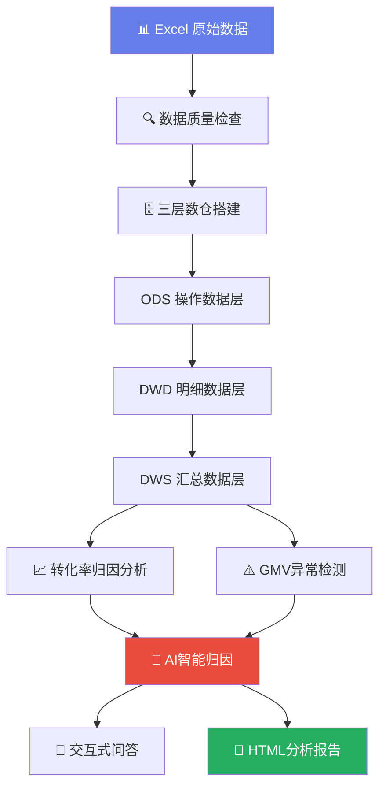

# 数据+AI驱动电商运营分析系统 — 作品集

## 一、项目概述

本项目从0到1搭建了一套电商运营分析系统，用户只需将Excel数据放入文件夹，运行即可自动完成数据清洗、数仓搭建、转化率归因、GMV异常检测、AI智能问答等全流程分析，最终输出专业报告。

## 二、系统架构



## 三、核心功能展示

### 3.1 核心指标一览

> 说明：系统自动汇总GMV、转化率、客单价、订单数等核心指标，一目了然。

### 3.2 转化率归因分析（核心能力）


> 说明：双Y轴展示流量与转化率变化趋势，自动识别"流量增长但转化率走低"的矛盾时段。


> 说明：浏览→加购→购买全链路漏斗，精准定位流失最严重的环节。


> 说明：各渠道转化率对比，精准定位拖累整体转化率的具体渠道。

**分析结论：** 6月转化率降至12%，主因是流量增量主要来自转化率最低的渠道（如小程序、短视频等），拉低了整体水平。同时漏斗分析显示浏览→加购环节转化率偏低，商品详情页吸引力不足。

### 3.3 GMV异常检测与归因


> 说明：基于3-sigma原则+同比变化率双重检测，自动标注GMV异常点。红线为3σ上下界，蓝色虚线为均值。

**归因框架：** 流量端 → 转化端 → 客单价，三层逐级排查，快速定位异常根源。每个异常点对比前7天均值，自动计算各层贡献百分比。

### 3.4 AI智能问答

以下为系统内置的交互式问答功能示例，用户可用自然语言提问，AI基于真实数据实时回答：

```
============================================================
  数据+AI驱动电商运营分析系统 — 交互式问答示例
  时间: 2026-07-27 15:39:29
============================================================

## 问题1: 转化率下降的主要原因是什么？
回答模式: AI (DeepSeek)

根据提供的数据，无法直接判断转化率下降的主要原因，因为数据仅展示了各品类和渠道的当前转化率，未提供历史对比数据。当前各品类转化率在9.4%-10.1%之间，其中家居最高（10.1%），食品最低（9.4%）；各渠道转化率在9.0%-10.8%之间，微信最高（10.8%），organic最低（9.0%）。若需分析下降原因，需对比历史转化率趋势，例如：是否某品类（如数码GMV占比最高但转化率9.5%）或某渠道（如抖音PV最高但转化率9.1%）近期出现下滑。此外，GMV异常点（如4月5日高GMV但偏差1.75σ）可能受促销或流量波动影响，但未直接关联转化率变化。建议补充各品类和渠道的周/月转化率变化数据，以定位具体下降来源。

----------------------------------------

## 问题2: 哪个品类GMV最高？
回答模式: AI (DeepSeek)

根据提供的数据，GMV最高的品类是**数码**，其GMV为**RMB 158,652**，占总GMV（RMB 315,202）的约50.3%。其他品类的GMV依次为：服装（RMB 56,148）、家居（RMB 45,323）、美妆（RMB 43,121）和食品（RMB 11,957）。数码品类的GMV显著领先，远超排名第二的服装品类。

----------------------------------------

## 问题3: 4月和6月数据对比有什么变化？
回答模式: AI (DeepSeek)

根据提供的数据，仅包含4月部分日期的GMV异常点（如4月3日、4月5日等），未提供6月的任何数据，因此无法进行4月与6月的对比分析。如需准确对比，请提供6月的GMV、品类、渠道等完整数据。当前数据不足以回答该问题。

----------------------------------------

```

> 注：AI启用时使用 DeepSeek API 进行智能问答，未配置API时自动降级为规则引擎，确保系统始终可用。

## 四、AI应用深度

| 层次 | 应用场景 | AI角色 | 我的角色 |
|------|---------|--------|---------|
| **Level 1** 辅助开发 | 代码生成与调试 | 按需求描述生成代码框架 | 架构设计、模块拆分、代码审查、测试验证 |
| **Level 2** 智能归因 | GMV异常分析 | 基于数据自动生成归因结论 | 设计三层归因框架、定义σ阈值、验证分析准确性 |
| **Level 3** 自然语言交互 | 交互式问答 | 理解自然语言问题、结合数据回答 | 构建数据上下文、保证数据准确性、设计降级方案 |

## 五、技术栈

| 层级 | 技术 | 用途 |
|------|------|------|
| 数据处理 | Python + Pandas + NumPy | 数据清洗、统计分析 |
| 数据存储 | SQLite | 轻量级三层数仓 |
| 可视化 | Plotly | 交互式图表（8种图表类型） |
| AI集成 | DeepSeek API (OpenAI兼容) | 智能归因、自然语言问答 |
| 报告输出 | Jinja2 + HTML/CSS | 专业HTML分析报告 |
| 统计分析 | SciPy | 皮尔逊相关系数、3-sigma检测 |

## 六、项目价值

1. **效率提升**：将电商分析师的经验沉淀为自动化系统，排查效率从小时级提升到分钟级
2. **可复用性**：三层归因框架可复用至其他业务场景（订单下降、用户流失、库存异常等）
3. **AI深度整合**：验证了AI在数据分析中的三个层次应用——辅助开发 → 智能归因 → 自然语言交互
4. **优雅降级**：AI不可用时自动切换规则引擎，系统始终可用，不依赖外部API

## 七、项目地址

https://github.com/Booker011/ecommerce-analysis
